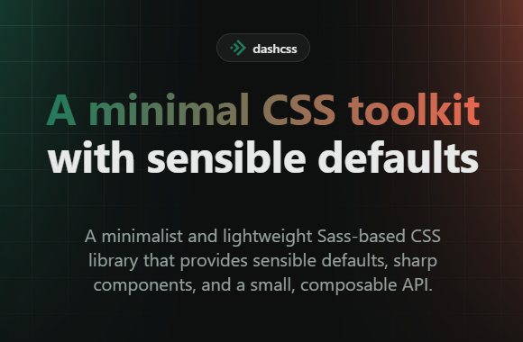

# dashcss



A minimal, modular Sass toolkit for building UIs with sensible defaults. It gives
you a small, cohesive foundation that stays lightweight and out of your way.

Influenced by Bootstrap and Tailwind; designed and tested with Vue 3 + Vite.

## What's inside

- **Design tokens**: a coherent system of color, spacing, radius, shadow and
  type, exposed as CSS custom properties.
- **Theming**: light and dark support out of the box.
- **Utilities**: a compact, composable set of utility classes.
- **Components**: a small set of ready-to-use UI building blocks.
- **Mixins & functions**: responsive and color helpers for your own Sass.

## Quick install

dashcss isn't published to npm. Install it straight from GitHub, pinned to a release tag:

```sh
npm install -D "dashcss@github:pirren/dashcss#v0.1.1"
```

Swap `v0.1.1` for whichever [tag](https://github.com/pirren/dashcss/tags) you
want to pin. Then pull it into your Sass entrypoint:

```scss
@use "dashcss";
```

## Documentation

Customization, overrides, live examples and the full API will live on the
**dashcss website** which will be the source of truth for everything beyond this overview.
_(Coming soon.)_

## License

Released under the [MIT License](LICENSE). See [NOTICE](NOTICE) for attribution.
